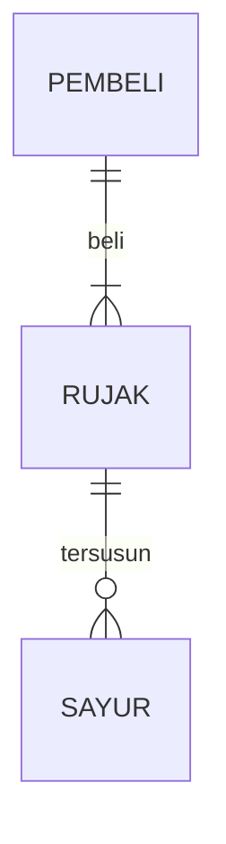

## 1.1 Latar Belakang

Dalam dinamika masyarakat modern, partisipasi aktif warga negara dalam pembangunan dan pengambilan keputusan pemerintah menjadi semakin krusial. Masyarakat yang merasa memiliki saluran untuk menyampaikan aspirasi, keluhan, dan ide-ide konstruktif dapat memberikan kontribusi positif terhadap pembangunan dan perbaikan kebijakan. Namun, seringkali terdapat kesenjangan antara harapan masyarakat dan kemampuan mereka untuk menyampaikan suara mereka kepada pemerintah. Oleh karena itu, diperlukan sebuah platform inovatif yang memfasilitasi komunikasi dua arah antara pemerintah dan masyarakat.

## 1.2. Deksripsi Teknologi Informasi

AspirasiKita adalah sebuah inisiatif yang bertujuan untuk memberikan suara kepada masyarakat dalam proses pembangunan dan pengambilan keputusan pemerintah.Inisiatif ini menciptakan ruang untuk masyarakat menyampaikan aspirasi, keluhan, dan ide-ide konstruktif secara terperinci kepada pemerintah.

Logo dan Identitas Visual:
Logo "AspirasiKita" menciptakan identitas visual yang kuat, mencerminkan keterbukaan, keberagaman, dan persatuan. Dengan sentuhan desain modern, logo tersebut menjadi lambang dari kolaborasi antara masyarakat dan pemerintah.

Header dan Informasi Awal:
Surat dimulai dengan header yang mencakup logo "AspirasiKita", alamat pengirim, dan tanggal pengiriman. Informasi ini memberikan kesan formal dan memberikan kerangka waktu kepada surat tersebut.

Salam Pembuka:
Salam pembuka yang ramah dan menyambut menciptakan atmosfer kolaboratif dan non-konfrontatif. Tujuan surat ini ditegaskan sebagai sarana untuk memperkuat komunikasi dua arah antara pemerintah dan masyarakat.

Pendahuluan:
Bagian ini memberikan gambaran singkat tentang latar belakang pentingnya partisipasi masyarakat dalam pembangunan dan kebijakan. Pendahuluan ini bertujuan untuk membangun pemahaman bersama akan maksud dan tujuan surat ini.

Penjelasan Aspirasi dan Keluhan:
Bagian utama surat berisi aspirasi, keluhan, dan ide-ide masyarakat. Setiap poin didukung dengan penjelasan mendalam, menyediakan konteks yang diperlukan untuk pemahaman yang lebih baik oleh pemerintah.

Ruang Diskusi:
Referensi atau kutipan dari ruang diskusi tematik mencerminkan keragaman pandangan masyarakat dan upaya bersama untuk mencapai solusi. Ini memberikan dimensi partisipatif yang melibatkan banyak suara dari berbagai lapisan masyarakat.

Pelacakan Keluhan:
Pembaruan singkat tentang status keluhan sebelumnya dan tanggapan pemerintah memberikan transparansi dan membangun kepercayaan antara masyarakat dan pemerintah.

Panggilan Aksi:
Seksi panggilan aksi memberikan arahan yang jelas kepada pemerintah untuk merespons aspirasi dan keluhan yang disampaikan dalam surat. Ini menciptakan harapan untuk langkah-langkah konkrit dan perubahan yang dapat diwujudkan.

Salam Penutup:
Ucapan terima kasih atas perhatian dan waktu yang diberikan oleh pemerintah, dengan harapan untuk kolaborasi lebih lanjut. Salam penutup menciptakan kesan positif dan terbuka untuk dialog yang berkelanjutan.

Tanda Tangan dan Informasi Kontak:
Tanda tangan atau tandatangan digital menambahkan keabsahan kepada surat, sementara informasi kontak yang jelas memudahkan pemerintah untuk merespons atau menghubungi pengirim surat.

Surat AspirasiKita dirancang sebagai sarana formal yang profesional dan efektif untuk memperkuat keterlibatan masyarakat dalam pembangunan dan memperjelas saluran komunikasi antara pemerintah dan warganya.

## 1.3. Branding
Merk : AspirasiKita
Logo : Logo AspirasiKita didesain dengan simbol yang mencerminkan kesatuan dan keterbukaan. Mungkin terdapat elemen-elemen yang merepresentasikan tangan bersatu, membentuk puzzle bersama, atau kombinasi simbol-simbol lain yang menggambarkan kolaborasi antara masyarakat dan pemerintah. Warna yang dipilih harus bersahaja dan bersahabat.
campaign : Meningkatkan kesadaran masyarakat tentang AspirasiKita sebagai platform untuk menyampaikan aspirasi dan keluhan kepada pemerintah, membangun partisipasi aktif, dan menciptakan perubahan positif dalam komunitas.
Tagline : "Bersama Membangun Masa Depan AspirasiKita, Suara Kita"
Target User : Warga Biasa:

Usia: 18-60 tahun.
Masyarakat yang peduli dan aktif dalam isu-isu lokal.
Mereka yang ingin menyampaikan aspirasi, keluhan, atau ide-ide konstruktif kepada pemerintah.
Mahasiswa dan Pelajar:

Usia: 16-25 tahun.
Mahasiswa dan pelajar yang ingin berpartisipasi aktif dalam proses pembangunan dan merasa memiliki kontribusi yang berarti.
Pemimpin Masyarakat Lokal:

Usia: 25-60 tahun.
Tokoh-tokoh masyarakat, pemimpin kelompok, atau anggota lembaga swadaya masyarakat yang ingin membawa aspirasi masyarakatnya kepada pemerintah.
UI :  - Mudah dan Sederhana
      - Warna : Biru Muda dan Hijau Terang:
Kombinasi ini menciptakan perpaduan yang menenangkan dan segar. Biru muda memberikan kesan tenang dan keterbukaan, sementara hijau terang menambahkan elemen optimisme dan keberlanjutan.
    
## 2. User Story

Tahap ini menjelaskan tentang prioritas antara Admin, Pekerja dan Customer untuk  mewujudkan fitur-fitur yang sudah dirancanakan pada aplikasi yang akan dibuat.

Sebagai | Saya ingin bisa | Sehingga | Prioritas
---|------|------|---
Pengguna |Ingin dapat membuat akun dengan mudah. | bisa mulai menyampaikan aspirasi dan keluhan saya kepada pemerintah. |⭐️⭐️⭐️⭐️⭐️  | ⭐️⭐️⭐️⭐️⭐️
Pengguna| Saya ingin mengisi formulir aspirasi dengan detail. | pemerintah dapat memahami isu saya dengan jelas. | ⭐️⭐️⭐️⭐️⭐️
Pengguna| ingin menerima pembaruan tentang status dan tanggapan terhadap aspirasi saya. | agar saya tahu bahwa suara saya didengar dan diperhatikan. | ⭐️⭐️⭐️⭐️⭐️
Pengguna | ingin dapat bergabung dalam forum atau ruang diskusi untuk berbicara. | agar masyarakat tau tentang isu isu tertentu. | ⭐️⭐️⭐️⭐️
Admin | Saya ingin dapat melihat laporan dan analisis data aspirasi untuk mendukung pengambilan keputusan dan perencanaan kebijakan. | Bisa mengetahui aspirasi dan keluhan masyarakat. | ⭐️⭐️⭐️⭐️⭐️
Admin | ingin memberikan tanggapan langsung kepada pengguna yang menyampaikan aspirasi. | mereka merasa dihargai dan terhubung dengan pemerintah. | ⭐️⭐️⭐️⭐️⭐️
Admin | Saya ingin melihat laporan dan analisis data aspirasi untuk memahami tren, kebutuhan, dan prioritas masyarakat. | Bisa melihat statistik data aspirasi. | ⭐️⭐️⭐️⭐️⭐️
Admin | Saya ingin memiliki akses penuh ke dasbor admin. | Saya dapat memonitor dan mengelola semua aspirasi dan keluhan yang masuk. | ⭐️⭐️⭐️⭐️⭐️

## 3. Struktur Data

Cara membuat aneka macam bentuk grafik menggunakan mermaid.js bisa lihat di [https://mermaid.js.org/syntax/entityRelationshipDiagram.html](https://mermaid.js.org/syntax/entityRelationshipDiagram.html) 

## 4. Arsitektur Sistem

Masih pake mermaid.js juga bisa lihat flowchart di [https://mermaid.js.org/syntax/flowchart.html](https://mermaid.js.org/syntax/flowchart.html)

## 5. Teknologi, Library, dan Framework

bla bla bla

## 6. Desain User Experience dan User Interface

Bisa load image 

## 7. Demonstrasi Video

Link youtube nya

## 8. Bagaimana mesin komputasi dan sistem operasi berperan dalam produk teknologi informasimu ?

Link youtube nya di detik jawaban ini

## 9. Bagaimana algoritma, struktur data, dan bahasa pemrograman berperan dalam produk teknologi informasimu ?

Link youtube nya di detik jawaban ini

## 10. Bagaimana metode pengembangan perangkat lunak / Software Development Life Cycle berperan dalam produk teknologi informasimu ?

Link youtube nya di detik jawaban ini

## 11. Bagaimana database / sistem basis data berperan dalam produk teknologi informasimu ?

Link youtube nya di detik jawaban ini
