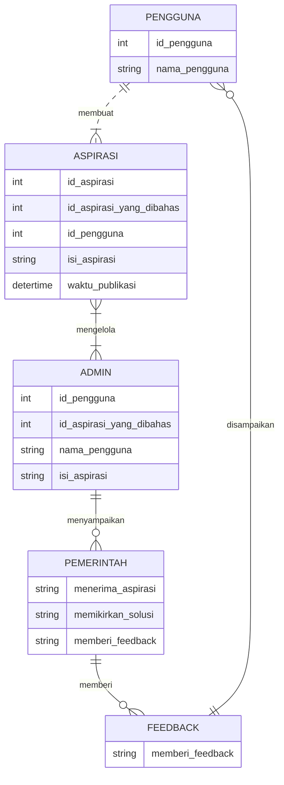
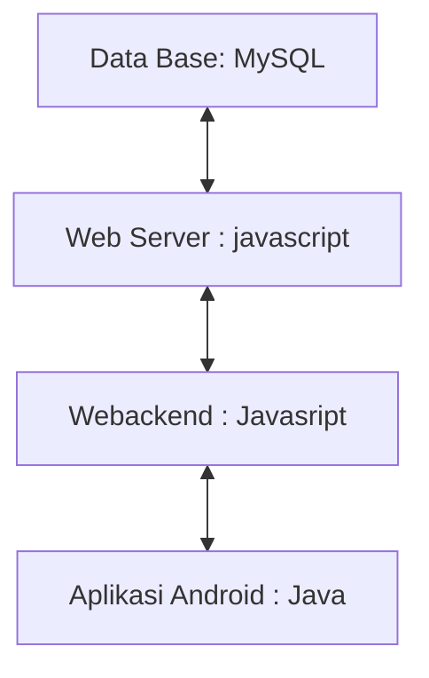

## 1.1 Latar Belakang

WeatherApp hadir sebagai solusi yang komprehensif untuk memenuhi kebutuhan informasi cuaca pengguna dengan cara yang menarik dan mudah diakses. Dengan fokus pada pengalaman pengguna yang dinamis, aplikasi ini menyajikan kondisi cuaca saat ini secara visual melalui latar belakang yang responsif. Dengan integrasi elemen seperti gradasi langit, efek hujan, dan transisi siang-malam, WeatherApp tidak hanya memberikan informasi cuaca, tetapi juga menciptakan pengalaman yang menyenangkan dan menarik. Dukungan geolokasi mempersonalisasi pengalaman pengguna dengan menyajikan informasi cuaca yang tepat sesuai dengan lokasi pengguna. Latar belakang yang dinamis dan efek interaktif bertujuan untuk menjadikan pengguna lebih terlibat dan terkoneksi dengan informasi cuaca sekitar mereka.

## 1.2. Deksripsi Teknologi Informasi

WeatherApp dibangun dengan memanfaatkan teknologi informasi terkini, menggunakan kerangka kerja React Native untuk pengembangan aplikasi seluler lintas platform. Integrasi React Navigation memungkinkan navigasi yang mulus antara berbagai layar, sementara komponen dari React Native menyediakan antarmuka pengguna yang responsif dan ramah pengguna. Aplikasi ini mengambil keuntungan dari layanan cuaca eksternal atau API seperti OpenWeatherMap untuk memperoleh data cuaca real-time. Animasi dan efek visual diterapkan menggunakan CSS dan JavaScript, memberikan sentuhan estetika pada latar belakang dan antarmuka pengguna. Dengan demikian, WeatherApp menciptakan pengalaman cuaca yang informatif dan menarik melalui gabungan teknologi modern dan desain yang intuitif.

## 1.3. Branding
- Merk : AspirasiKita
- Logo : Logo AspirasiKita didesain dengan simbol yang mencerminkan kesatuan dan keterbukaan. Mungkin terdapat elemen-elemen yang merepresentasikan tangan bersatu, membentuk puzzle bersama, atau kombinasi simbol-simbol lain yang menggambarkan kolaborasi antara masyarakat dan pemerintah. Warna yang dipilih harus bersahaja dan bersahabat.
- campaign : Meningkatkan kesadaran masyarakat tentang AspirasiKita sebagai platform untuk menyampaikan aspirasi dan keluhan kepada pemerintah, membangun partisipasi aktif, dan menciptakan perubahan positif dalam komunitas.
- Tagline : "Bersama Membangun Masa Depan AspirasiKita, Suara Kita"
- Target User :
      - Warga Biasa:
      - Usia: 18-60 tahun.
      - Masyarakat yang peduli dan aktif dalam isu-isu lokal.
      - Mereka yang ingin menyampaikan aspirasi, keluhan, atau ide-ide konstruktif kepada pemerintah.
      - Mahasiswa dan Pelajar:
      - Usia: 16-25 tahun.
      - Mahasiswa dan pelajar yang ingin berpartisipasi aktif dalam proses pembangunan dan merasa memiliki kontribusi yang              berarti.
  - Pemimpin Masyarakat Lokal:

      - Usia: 25-60 tahun.
      - Tokoh-tokoh masyarakat, pemimpin kelompok, atau anggota lembaga swadaya masyarakat yang ingin membawa aspirasi                   masyarakatnya kepada pemerintah.
- UI :
      - Mudah dan Sederhana
      - Warna : Biru Muda dan Hijau Terang:
Kombinasi ini menciptakan perpaduan yang menenangkan dan segar. Biru muda memberikan kesan tenang dan keterbukaan, sementara hijau terang menambahkan elemen optimisme dan keberlanjutan.
    
## 2. User Story

Tahap ini menjelaskan tentang prioritas antara Admin, Pekerja dan Customer untuk  mewujudkan fitur-fitur yang sudah dirancanakan pada aplikasi yang akan dibuat.

Sebagai | Saya ingin bisa | Sehingga | Prioritas
---|------|------|---
Pengguna |Ingin dapat membuat akun dengan mudah. | bisa mulai menyampaikan aspirasi dan keluhan saya kepada pemerintah. |⭐️⭐️⭐️⭐️⭐️  | ⭐️⭐️⭐️⭐️⭐️
Pengguna| Saya ingin mengisi formulir aspirasi dengan detail. | pemerintah dapat memahami isu saya dengan jelas. | ⭐️⭐️⭐️⭐️⭐️
Pengguna| ingin menerima pembaruan tentang status dan tanggapan terhadap aspirasi saya. | agar saya tahu bahwa suara saya didengar dan diperhatikan. | ⭐️⭐️⭐️⭐️⭐️
Pengguna | ingin dapat bergabung dalam forum atau ruang diskusi untuk berbicara. | agar masyarakat tau tentang isu isu tertentu. | ⭐️⭐️⭐️⭐️
Admin | Saya ingin dapat melihat laporan dan analisis data aspirasi untuk mendukung pengambilan keputusan dan perencanaan kebijakan. | Bisa mengetahui aspirasi dan keluhan masyarakat. | ⭐️⭐️⭐️⭐️⭐️
Admin | ingin memberikan tanggapan langsung kepada pengguna yang menyampaikan aspirasi. | mereka merasa dihargai dan terhubung dengan pemerintah. | ⭐️⭐️⭐️⭐️⭐️
Admin | Saya ingin melihat laporan dan analisis data aspirasi untuk memahami tren, kebutuhan, dan prioritas masyarakat. | Bisa melihat statistik data aspirasi. | ⭐️⭐️⭐️⭐️⭐️
Admin | Saya ingin memiliki akses penuh ke dasbor admin. | Saya dapat memonitor dan mengelola semua aspirasi dan keluhan yang masuk. | ⭐️⭐️⭐️⭐️⭐️

## 3. Struktur Data

## 4. Arsitektur Sistem

## 5. Teknologi, Library, dan Framework

<?xml version="1.0" encoding="utf-8"?>
<RelativeLayout xmlns:android="http://schemas.android.com/apk/res/android"
    xmlns:tools="http://schemas.android.com/tools"
    android:layout_width="match_parent"
    android:layout_height="match_parent"
    tools:context=".MainActivity">

    <EditText
        android:id="@+id/inputJudul"
        android:layout_width="match_parent"
        android:layout_height="wrap_content"
        android:hint="Judul Aspirasi"
        android:layout_margin="16dp"/>

    <EditText
        android:id="@+id/inputDeskripsi"
        android:layout_width="match_parent"
        android:layout_height="wrap_content"
        android:hint="Deskripsi Aspirasi"
        android:layout_below="@id/inputJudul"
        android:layout_margin="16dp"/>

    <Button
        android:id="@+id/btnTambah"
        android:layout_width="wrap_content"
        android:layout_height="wrap_content"
        android:text="Tambah Aspirasi"
        android:layout_below="@id/inputDeskripsi"
        android:layout_marginTop="16dp"
        android:layout_marginStart="16dp"/>

    <Button
        android:id="@+id/btnLihat"
        android:layout_width="wrap_content"
        android:layout_height="wrap_content"
        android:text="Lihat Aspirasi"
        android:layout_below="@id/btnTambah"
        android:layout_marginTop="16dp"
        android:layout_marginStart="16dp"/>

    <LinearLayout
        android:id="@+id/containerAspirasi"
        android:layout_width="match_parent"
        android:layout_height="wrap_content"
        android:orientation="vertical"
        android:layout_below="@id/btnLihat"
        android:layout_marginTop="16dp"/>

</RelativeLayout>

## 6. Desain User Experience dan User Interface

Bisa load image 

![poto]:\Users\user\Downloads\WhatsApp Image 2023-11-13 at 22.29.29_37d7b3b4.jpg")
## 7. Demonstrasi Video

Link youtube nya

## 8. Bagaimana mesin komputasi dan sistem operasi berperan dalam produk teknologi informasimu ?

Link youtube nya di detik jawaban ini

## 9. Bagaimana algoritma, struktur data, dan bahasa pemrograman berperan dalam produk teknologi informasimu ?

Link youtube nya di detik jawaban ini

## 10. Bagaimana metode pengembangan perangkat lunak / Software Development Life Cycle berperan dalam produk teknologi informasimu ?

Link youtube nya di detik jawaban ini

## 11. Bagaimana database / sistem basis data berperan dalam produk teknologi informasimu ?

Link youtube nya di detik jawaban ini
