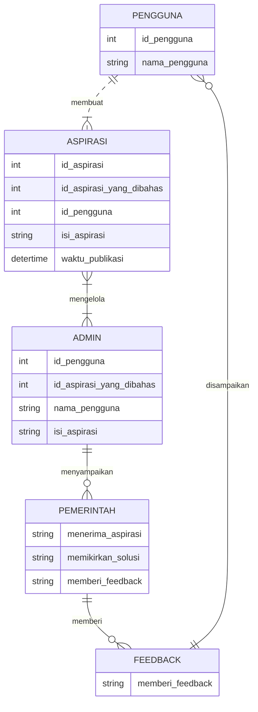
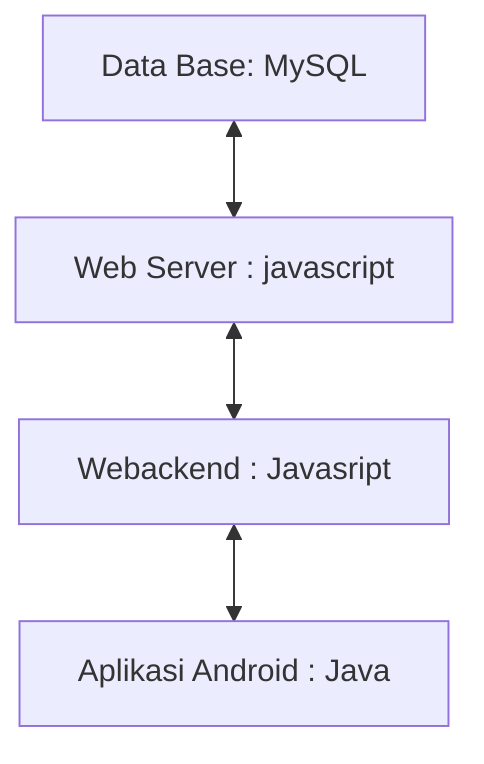

## 1.1 Latar Belakang

WeatherApp hadir sebagai solusi yang komprehensif untuk memenuhi kebutuhan informasi cuaca pengguna dengan cara yang menarik dan mudah diakses. Dengan fokus pada pengalaman pengguna yang dinamis, aplikasi ini menyajikan kondisi cuaca saat ini secara visual melalui latar belakang yang responsif. Dengan integrasi elemen seperti gradasi langit, efek hujan, dan transisi siang-malam, WeatherApp tidak hanya memberikan informasi cuaca, tetapi juga menciptakan pengalaman yang menyenangkan dan menarik. Dukungan geolokasi mempersonalisasi pengalaman pengguna dengan menyajikan informasi cuaca yang tepat sesuai dengan lokasi pengguna. Latar belakang yang dinamis dan efek interaktif bertujuan untuk menjadikan pengguna lebih terlibat dan terkoneksi dengan informasi cuaca sekitar mereka.

## 1.2. Deksripsi Teknologi Informasi

WeatherApp dibangun dengan memanfaatkan teknologi informasi terkini, menggunakan kerangka kerja React Native untuk pengembangan aplikasi seluler lintas platform. Integrasi React Navigation memungkinkan navigasi yang mulus antara berbagai layar, sementara komponen dari React Native menyediakan antarmuka pengguna yang responsif dan ramah pengguna. Aplikasi ini mengambil keuntungan dari layanan cuaca eksternal atau API seperti OpenWeatherMap untuk memperoleh data cuaca real-time. Animasi dan efek visual diterapkan menggunakan CSS dan JavaScript, memberikan sentuhan estetika pada latar belakang dan antarmuka pengguna. Dengan demikian, WeatherApp menciptakan pengalaman cuaca yang informatif dan menarik melalui gabungan teknologi modern dan desain yang intuitif.

## 1.3. Branding
- Merk : WeatherApp
- Logo : Desain logo yang sederhana dan bersih dengan elemen seperti matahari, awan, dan tetes air dapat memberikan kesan tentang informasi cuaca yang jelas dan mudah dimengerti.
- Tagline : "Beyond the Forecast"
- Target User :
      - Warga Biasa:
      - Usia: 18-60 tahun.
      - Masyarakat yang peduli dengan cuaca setiap hari.
      - Mereka yang ingin mengetahui cuaca/suhu setiap hari.
- UI :
      - Mudah dan Sederhana
      - Warna : Biru Muda dan Hijau Terang:
Kombinasi ini menciptakan perpaduan yang menenangkan dan segar. Biru muda memberikan kesan tenang dan keterbukaan, sementara hijau terang menambahkan elemen optimisme dan keberlanjutan.
    
## 2. User Story

Tahap ini menjelaskan tentang prioritas antara Admin, Pekerja dan Customer untuk  mewujudkan fitur-fitur yang sudah dirancanakan pada aplikasi yang akan dibuat.

Sebagai | Saya ingin bisa | Sehingga | Prioritas
---|------|------|---
Pengguna |saya ingin dapat melihat perkiraan cuaca saat ini di lokasi saya secara langsung pada halaman utama aplikasi. |⭐️⭐️⭐️⭐️⭐️  | ⭐️⭐️⭐️⭐️⭐️
Pengguna|  saya ingin dapat memasukkan lokasi kota atau koordinat geografis untuk melihat perkiraan cuaca di lokasi tersebu. | ⭐️⭐️⭐️⭐️⭐️
Pengguna| saya ingin melihat perkiraan cuaca untuk beberapa hari ke depan agar saya dapat merencanakan aktivitas saya. | ⭐️⭐️⭐️⭐️⭐️
Pengguna | saya ingin melihat ikon atau gambar yang mencerminkan kondisi cuaca saat ini untuk memudahkan pemahaman visual. |  | ⭐️⭐️⭐️⭐️
Admin | Saya ingin tau berapa banyak pengguna yang menggunakan aplikasi ini. |  |⭐️⭐️⭐️⭐️⭐️|

## 4. Arsitektur Sistem

## 5. Teknologi, Library, dan Framework

<?xml version="1.0" encoding="utf-8"?>
<RelativeLayout xmlns:android="http://schemas.android.com/apk/res/android"
    xmlns:tools="http://schemas.android.com/tools"
    android:layout_width="match_parent"
    android:layout_height="match_parent"
    tools:context=".MainActivity">

   import axios from "axios";
import { apiKey } from "../constants";

const forecastEndpoint = params=> `https://api.weatherapi.com/v1/forecast.json?key=${apiKey}&q=${params.cityName}&days=${params.days}`;
const locationsEndpoint = params=> `https://api.weatherapi.com/v1/search.json?key=${apiKey}&q=${params.cityName}`;
const apiCall = async (endpoint)=>{
    const options = {
        method: 'GET',
        url: endpoint,
    };

      try{
        const response = await axios.request(options);
        return response.data;
      }catch(error){
        console.log('error: ',error);
        return {};
    }
}

export const fetchWeatherForecast = params=>{
    let forecastUrl = forecastEndpoint(params);
    return apiCall(forecastUrl);
}

export const fetchLocations = params=>{
    let locationsUrl = locationsEndpoint(params);
    return apiCall(locationsUrl);
}

## 6. Desain User Experience dan User Interface

Bisa load image 

![poto]:\Users\user\Downloads\WhatsApp Image 2023-11-13 at 22.29.29_37d7b3b4.jpg")
## 7. Demonstrasi Video

Link youtube nya

## 8. Bagaimana mesin komputasi dan sistem operasi berperan dalam produk teknologi informasimu ?

Link youtube nya di detik jawaban ini

## 9. Bagaimana algoritma, struktur data, dan bahasa pemrograman berperan dalam produk teknologi informasimu ?

Link youtube nya di detik jawaban ini

## 10. Bagaimana metode pengembangan perangkat lunak / Software Development Life Cycle berperan dalam produk teknologi informasimu ?

Link youtube nya di detik jawaban ini

## 11. Bagaimana database / sistem basis data berperan dalam produk teknologi informasimu ?

Link youtube nya di detik jawaban ini
